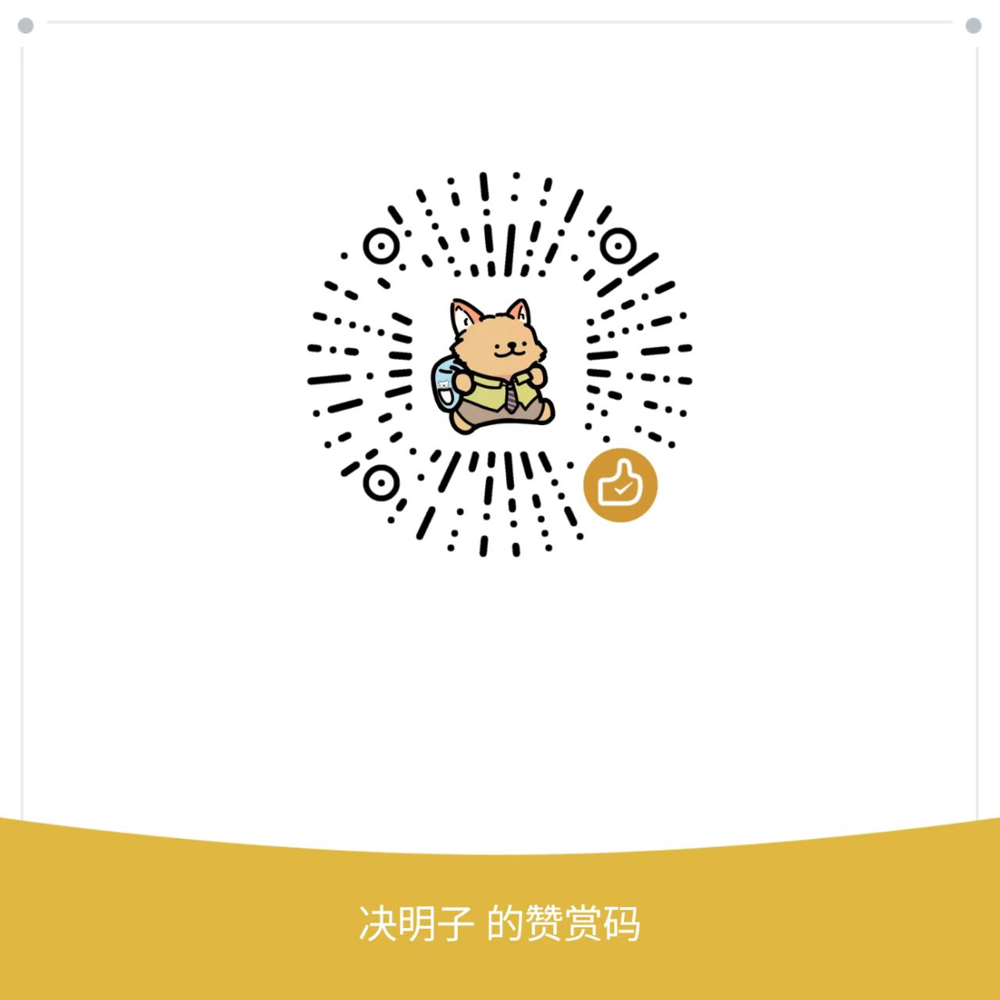

# 商陆 - 决明子学术助手

一个基于 AI 的下一代科研文献管理与分析系统，专注于提供纯粹、高效的学术阅读体验。

## ✨ 核心特性

### 🤖 智能文献解析
- **PDF 自动解析**：集成 MinerU API，高精度提取文献内容
- **AI 深度分析**：利用 DeepSeek 模型自动提取：
  - 标题、作者、摘要
  - 主要结论与创新点
  - 实验方法与详细步骤
  - 术语解释与研究启发

### 🌐 智能翻译
- **段落级翻译**：保留原文结构的专业翻译
- **术语管理**：可自定义术语库，确保翻译一致性
- **双语对照**：支持译文与原文对照阅读

### 🔗 知识图谱
- **自动构建关系网络**：基于 AI 分析文献间的引用、相似与对比关系
- **可视化交互**：动态图谱展示，支持拖拽与缩放
- **聚类分析**：自动识别研究主题聚类

### 📊 周报生成
- **一键生成**：选择多篇文献，AI 自动生成结构化周报
- **Markdown 导出**：支持导出为标准 Markdown 格式

### 🎨 科研绘图
- **AI 生成图示**：集成 Nano Banana，根据提示词生成科研风格图示
- **提示词优化**：可选 AI 润色提示词，提升生成质量
- **历史管理**：保存生成历史，随时查看和下载

### 🏷️ 标签管理
- **灵活分类**：自定义标签体系
- **批量操作**：批量添加、删除标签
- **智能筛选**：基于标签快速定位文献

### 👥 多用户系统
- **用户隔离**：每个用户拥有独立的文献库和数据
- **邀请码注册**：管理员可创建邀请码，控制用户注册
- **权限管理**：支持管理员与普通用户角色

---

## 🚀 快速开始

### 环境要求
- Python 3.8+
- 推荐使用 Conda 环境管理

### 安装步骤

1. **克隆仓库**
```bash
git clone https://github.com/zijueming/ShangLu_Paper
```

2. **创建虚拟环境**
```bash
conda create -n RAG python=3.10
conda activate RAG
```

3. **安装依赖**
```bash
pip install -r requirements.txt
```

4. **配置 API 密钥**
在用户界面的 "账号" 页面中配置以下 API Key：
- **DeepSeek API Key**：用于文献分析、翻译、周报生成
- **MinerU API Key**：用于 PDF 解析
- **Nano Banana API Key**：用于科研绘图

5. **启动服务**
```bash
python main.py
```

默认访问地址：`http://127.0.0.1:8000`

### 命令行参数
```bash
python main.py --output ./output --host 0.0.0.0 --port 8080
```
- `--output`：输出目录（默认 `./output`）
- `--host`：服务监听地址（默认 `127.0.0.1`）
- `--port`：服务端口（默认 `8000`）

---

## 📖 使用指南

### 首次使用
1. **访问主页**：浏览器打开 `http://127.0.0.1:8000`
2. **注册账号**：首次注册无需邀请码，后续用户需由管理员提供邀请码
3. **配置 API Key**：进入 "账号" 页面，填写必要的 API 密钥
4. **导入文献**：在 "文献库" 页面上传 PDF 文件

### 核心功能流程

#### 📄 文献导入与分析
1. 在 "文献库" 页面点击 "导入文献"
2. 选择本地 PDF 文件或输入 arXiv URL
3. 系统自动调用 MinerU 解析 PDF
4. AI 自动分析并提取关键信息
5. 查看文献详情页获取完整分析结果

#### 🌍 翻译文献
1. 在文献详情页或 "翻译" 页面
2. 选择目标语言（如 `zh-CN`）
3. 点击 "翻译" 按钮
4. 等待翻译完成，支持查看双语对照

#### 🔗 构建知识图谱
1. 导入多篇相关文献
2. 进入 "关系图谱" 页面
3. 点击 "重新分析" 生成图谱
4. 交互式查看文献关系网络

#### 📊 生成周报
1. 进入 "周报" 页面
2. 选择本周阅读的文献
3. 点击 "生成周报"
4. 下载 Markdown 格式周报

---

## 🎨 界面主题

系统采用 **"现代学术翡翠"（Modern Academic Emerald）** 主题：
- **配色**：以翡翠绿 (#059669) 为主色调，搭配灰白背景
- **设计理念**：极简主义 + 玻璃态质感
- **字体**：Inter 字体，提升可读性
- **动效**：细腻的微交互与平滑过渡

---

## 🛠️ 技术架构

### 后端
- **框架**：Python 标准库 `http.server`
- **数据库**：SQLite（用户认证与会话管理）
- **AI 服务**：
  - DeepSeek API（文献分析、翻译）
  - MinerU API（PDF 解析）
  - Nano Banana API（图像生成）

### 前端
- **纯原生技术栈**：HTML + CSS + Vanilla JavaScript
- **样式**：自定义 CSS，支持主题变量
- **交互**：基于 Canvas 的关系图谱可视化

### 文件存储
- **用户隔离**：每个用户拥有独立的 `output/users/<user_id>` 目录
- **文献目录**：每篇文献对应独立文件夹，包含：
  - `meta.json`：元数据
  - `analysis.json`：AI 分析结果
  - `result/full.md`：完整文本
  - `result/translated.md`：翻译结果
  - `result/images/`：提取的图片

---

## 📂 项目结构

```
Demo2/
├── main.py                 # 启动入口
├── requirements.txt        # 依赖列表
├── app/
│   ├── analysis/           # AI 分析模块
│   ├── auth/               # 用户认证
│   ├── clients/            # 第三方 API 客户端
│   ├── draw/               # 科研绘图
│   ├── jobs/               # 任务管理
│   ├── relationship/       # 关系图谱
│   ├── tags/               # 标签管理
│   ├── translation/        # 翻译模块
│   ├── ui/                 # Web 界面
│   │   ├── assets/         # CSS/JS
│   │   ├── pages/          # 页面组件
│   │   └── server.py       # HTTP 服务器
│   ├── viewer/             # 文献阅读器
│   └── weekly/             # 周报生成
└── output/                 # 数据输出目录
```

---

## 🔐 安全性

- **会话管理**：基于 Cookie 的会话，TTL 为 14 天
- **密码存储**：使用 bcrypt 哈希
- **数据隔离**：用户数据完全隔离，互不可见
- **API Key 安全**：API Key 存储在用户专属数据库中

---

## 🤝 贡献

欢迎提交 Issue 和 Pull Request！

---

## 📄 许可证

本项目仅供学术研究使用。

---

## 💡 致谢

- **DeepSeek**：提供强大的 AI 分析能力
- **MinerU**：高质量的 PDF 解析服务
- **Nano Banana**：专业的 AI 绘图服务

---

**决明子2025 • 商陆学术助手**


